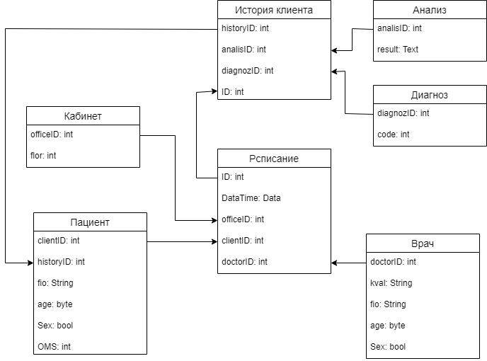

# Home Work 5
### Cформировать UML-диаграмму, отвечающей задаче: Необходимо разделить на горизонтальные уровни «Редактор 3D графики”. Один пользователь. Программа работает на одном компьютере без выхода в сеть.

